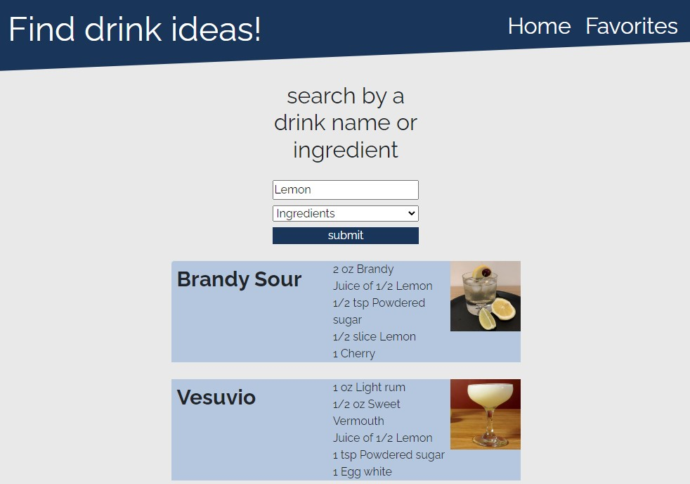

##Project Title: Find My Drink 
##Group 5 | Project 01 | Alex Doll, Jon Helton, Zach Gilbert, Mohamed Mohamed & Amy Kilgour 

##Usage
To use the application, visit the production version of the app on your browser. [https://x-is-for-alex.github.io/find-my-drink/](https://github.com/X-is-For-Alex/find-my-drink) 

##Objective 
This project was developed to fulfill Project 1's criteria, which included utilizing at least one API to create a Minimum Viable Product (MVP), developing two HTML pages, using LocalStorage, and implementing an input form.

##Description 
Find My Drink is a web application designed for mixed drink enthusiasts who want to explore new drink recipes. The app allows users to search for drink recipes by drink name or ingredients they have on hand. Users can also save their favorite drinks to a local storage and access them from the Favorites page. 

##Future Feature Development
Search by multiple ingredients
Search by spirit type
Filter by alcoholic and non-alcoholic ingredients

##Technologies
The application was developed using the following technologies:

HTML
CSS
JavaScript
jQuery
Google Fonts
Bootstrap

##Learning Experience
During the development of this project, our team learned the importance of git version control and communication. We also utilized Agile methodologies to work efficiently. Additionally, we learned about font libraries and new technologies such as jQuery, Google Fonts, and Bootstrap.